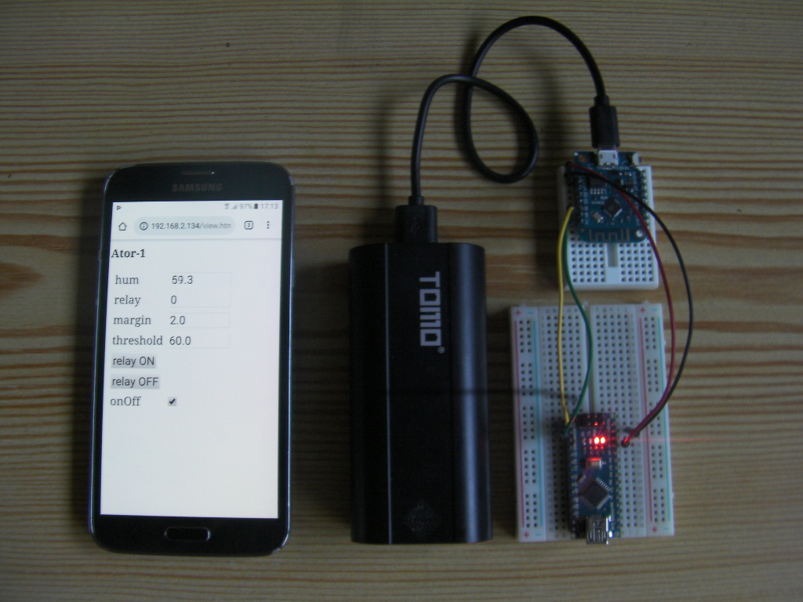
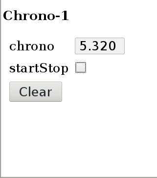

# BoardView

__En cours de construction - pas de code dispo pour l'instant__

BoardView est une classe C++ pour ESP8266 permettant de communiquer avec vos cartes arduinos à l'aide d'un navigateur Web (de façon interractive via l'usage d'une web socket) ou (bientot !) via une connexion TCP (pour l'automatisation du pilotage/controle des cartes avec d'autres programmes (scripts, Ruby, ...). 

Via le navigateur web il est possible :
  * d'obtenir une console réseau (similaire à la console de l'IDE arduino)
  * d'obtenir une vue des variables (int/float) de la carte avec possibiliter de les modifier, via une saisie avec clavier ou une checkbox. A cette vue peuvent être ajoutés des boutons qui, s'ils sont cliqués, émettent une (ou plusieurs) commandes à destination de la carte.
  
Via la connexion TCP il sera (bientôt) possible d'émettre toute commande à destinaton de tout autre carte/noeud (possédant un objet de type BoardView).

Pour fonctionner avec BoardView l'application doit intégrer le codage/décodage du protocole. Ce protocole sera décrit plus bas mais est un protocole orienté commandes (un mini shell Unix ;-)) que l'utilisateur (via le navigateur en cliquant sur des boutons) ou les programmes (via la connexion TCP) pourront émettres.

Dans l'image ci-dessous le d1-mini de sert que de pont vers un arduino (nano ici).

 

## Installation

Pré requis pour faire fonctionner les exemples :

  * Avoir installé la chaine de compilation pour votre Esp (voir par exemple [ici](https://github.com/esp8266/Arduino))
  * Avoir installé la bibliothèque "Web Sockets" de Markus Sattler (version 2.\*) (via le menu "Outils -> Gérer les bibliothèques" par exemple).
  * Avoir téléchargé et installé le ZIP de BoardView (en appliquant la procédure décrite par exemple [ici](https://www.robot-maker.com/ouvrages/tuto-arduino/bibliotheque-arduino/)).
  
## La vue

La vue de la carte est une page web ou les variables (de la carte) peuvent être consultées et/ou modifier et disposant éventuellement de boutons émettant des commandes. Les widgets disponibles pour l'instant sont minimalistes :

  * Label : pour visualiser uniquement un couple varName=value
  * Entry : comme Label mais si on clic dessus un popup permet de modifier la valeur.
  * CheckBox : permet de lancer des commandes si activée/désactivé
  * Button : permet de lancer des commandes
  
 Un aperçu de la vue de l'exemple n°1 :
 
  
 
 
## Le protocole de communication 

BoardView est conçu pour des échanges à base de commandes. Une commande est de la forme :

``cmd arg1 arg2 ... argN``

Une forme particulière de commande est la commande de modification de variable qui à la forme :

``varName=value``

Ou (à cause du signe = difficilement accessible à partir d'un clavier virtuel de smartphone)

``varname value``

Une autre particularité liée aux claviers virtuels qui ont tendance à mettre en majuscule la première lettre de la commande, est qu'une commande verra automatiquement sa première lettre passée en minuscule (un effet de bord est qu'il ne sera pas possible d'affecter la valeur aux variables dont le nom commence par une majuscule, mais qui met une majuscule à ses noms de variables ?, qui ?).

Le noeud destinataire d'une commande construira la réponse, également sous la forme d'une unique ligne, qu'il retournera à l'émetteur de la commande. Cela peut être un résultat, ou juste l'information que la commande s'est correctement déroulée ("ok") ou pas ("erreur : code ou message...")

La première (et éventuellement la seule) commande que doit être capable d'interpréte un noeud est la commande :

``dump``

Très simple (pas d'argument) mais indispensable car en réponse le noeud communique tous les couples ``varName=value`` des variables qu'il souhaite rendre visibles (exemple de réponse : "var1=23.2; otherVar=8; again=1").

Si le noeud veut rendre possible la modification de certaines de ses variables alors il doit interpréter les messages de la forme :

``varname=value # (on rappelle que l'espace peut remplacer '=')``

C'est tout pour la théorie, place à la pratique ;-)

## Premier exemple

Pour ce premier exemple nous utiliserons une petite application de type chronomètre destinée à tester l'interactivité offerte par la web socket (esp8266).

On souhaie plus précisément voir la valeur du chronomètre (chrono de type float), pouvoir démarrer/arrêter le chronomètre (variable startStop) et enfin disposer d'un bouton clear.  

Sachant cela on peut définir les commandes du protocole :

  * dump : récupérer les valeurs des variables. Réponse de la forme : "chrono=XXX; startStop=XXX"
  * On veut pouvoir modifier ``startStop`` donc il faudra interpréter les commandes de la forme ``chrono=...`` et  `` startStop=...``
  * on veut une commande ``clear`` arrêtant et réinitialisant le compteur. 

Voila ce que cela donne en  C avec les [fonctions utilitaires](BoardViewProto.h) :

```c++
// mini interpréteur de commandes simples de la forme :
// command arg1 arg2 ...
// variable=valeur

int parseRequest(char *request, char *response, unsigned len) {
	int ret=0; // code de retour 0 : ok, sinon code d'erreur.
	
	response[0]=0; //clear response
	
	// lowercase first letter (for smartphone keyboard)
	if(request[0]>='A' && request[0]<='Z') request[0]=request[0]+'a'-'A';

	// On utilise les fonctions utilitaires de codage/décodage d'une commande
	
	// commande dump
	// La commande dump doit retourner dans la variable response la liste des
	// couple varName=value que la carte souhaite exposer en lecture seule à 
	// l'extérieur.
	
	if(matchCmd(request,"dump")) {
		// On ajoute toutes les variables que l'on souhaite rendre visibles
		// L'ordre n'a pas d'importance.
		addFloat(response, MAX_LINE_LEN, "chrono", chrono, 3);
		addInt(response, MAX_LINE_LEN, "startStop", startStop);
	}
	
	// Accesseurs en écriture
	// On traite tous les messages de la forme varName=value
	// Les fonctions (de BoardViewProto.cpp)  de la forme matchAndAssign*
	// font cela très bien.
	 
	else if(matchAndAssignInt(request, "startStop", &startStop)) strcpy(response, "ok");
		
	// Autres commandes
	
	else if(matchCmd(request,"clear")) { startStop=0, chrono=0; response="ok"; }
	
	// Si la commande n'est pas reconnue, message d'erreur
	
	else { ret=1; sprintf(response, "Error : bad request : %s", request); }
	
	return ret; 
}
```


Ajoutons maintenant la vue graphique. Pour cela nous devons configurer un objet de type BoardView, lui associer notre fonction de décodage de protocole et définir l'apparence de la page Web associée aux variables. Ici c'est très basique :
On veut un champ montrant le chrono, une checkbox pour startStop et un bouton clear.

Le code complet de l'exemple. Adaptez le ssid et le mot de passe.

```


```

Une fois le programme téléversé, ouvrez la console, passez la vitesse à 115200 bauds, après redémarrage de la carte elle doit afficher l'IP attribuée à votre carte : ``Wifi : IP  addr : 192.168.1.X``

Dans la barre de saisie de votre navigateur copiez/collez l'IP. Vous atterrissez sur la page principale proposant une console (réseau) et la vue définie.


## Second exemple

BoardView peut également servir de pont entre un projet arduino sans capacité wifi mais implémentant le protocole de commandes définit plus haut et le réseau wifi. Le lien physique entre la carte arduino et le module esp8288 disposant de l'objet boardView est la liaison série (Serial) configurée à une vitesse de communication raisonnablement haute (115200 bauds).

Schéma des branchements :

Code sur la nano (chrono) :

Code sur le d1-mini (juste en mode "pont" web socket <-> Serial)


Quelques remarques :
  * la liaison série étant monopolisée des 2 cotés 
